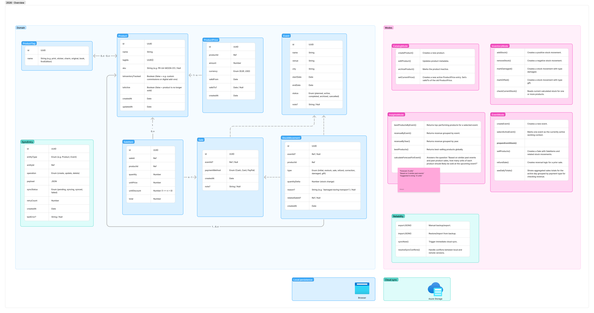

# Artist Buddy
Easy local-first mobile web app for small artists tracking inventory, conventions and sales. Artist Buddy ia a pure hobby project.

## Goal
This little app should help artists run an artist-alley booth even when convention Wi-Fi is bad or missing: track products, stock, prices, sales, etc. on the phone first, then sync to the cloud when connectivity returns (or just export the data locally). The main goal is to build an offline-first mobile web app that stays usable all day, survives flaky networks, and adds just enough cloud architecture to back up, sync, and deploy safely at hopefully low cost.

## Tech Stack
**Frontend**
- React + TypeScript + Vite
- TanStack Router & Query
- shadcn/ui?
- Tailwind CSS
- Dexie for IndexedDB?

**Cloud**
- Azure Static Web Apps for frontend hosting (+ built-in auth)
- Azure Functions for data sync
- Azure Blob Storage (JSON)
- GitHub Actions for CI/CD

## Development
**Prerequisites**
- Node.js 24 with npm

**Commands**
- Run `npm run dev` to start vite dev server at http://localhost:5173

**Structure**
```
routes/             # File-based routes, folder is only for route declarations
domain/             # Types for domain model
features/           # Page UI and domain-specific components       
```
Route tree is auto-generated in `lib/routeTree.gen.ts`, do not edit manually. `router.tsx` is the router setup file, see TanStack docs for further information.

## Concept


## Use Cases
Reworking

## Sync & Data Flow
Later

## Deployment
Later

## Auth
Later
